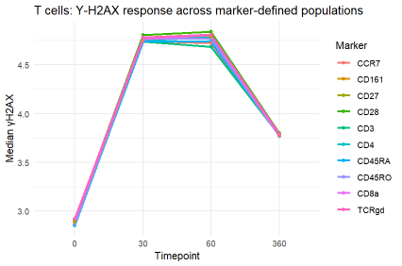
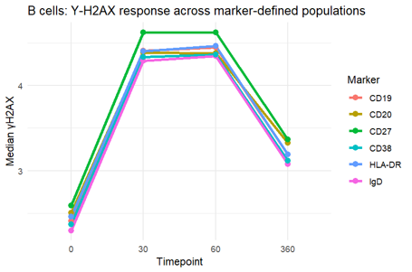
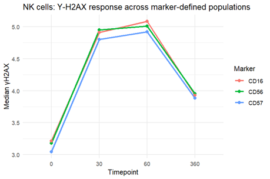
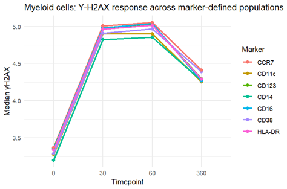

# DNA Damage Response Across Immune Cell Populations Using CyTOF

This project investigates how DNA Damage Response (DDR) varies across immune cell populations following radiation exposure using single-cell CyTOF data. PBMCs exposed to 2 Gray radiation were analyzed across multiple timepoints (0, 30, 60, and 360 minutes) using γH2AX as the primary DDR marker.

Rather than treating all immune cells as one population, this analysis explores how cellular phenotype, differentiation state, activation status, and immune lineage influence DDR magnitude and kinetics.

---

## Project Overview

### Main Questions

- How does γH2AX change after radiation exposure?
- Do all immune cells respond similarly?
- Does cellular phenotype influence DDR?
- Are DDR kinetics lineage-specific?

---

## Dataset

- Single-cell CyTOF PBMC dataset
- Radiation dose: 2 Gray
- Timepoints:
  - 0 min
  - 30 min
  - 60 min
  - 360 min
- Marker panel included immune lineage, activation, differentiation, and DDR markers.

---

## Analysis Workflow

### 1. Data Preprocessing

- Imported FCS files using `flowCore`
- Added metadata for timepoints
- Performed arcsinh transformation
- Removed technical and non-biological channels
- Renamed markers for biological interpretability

### 2. Immune Compartment Annotation

Cells were grouped into major immune compartments based on canonical marker expression:

| Cell Type | Markers |
|---|---|
| T cells | CD3, CD4, CD8a, CCR7, CD45RA, CD45RO |
| B cells | CD19, CD20, IgD |
| NK cells | CD56, CD16, NKG2A, CD57 |
| Myeloid cells | CD14, CD11c, CD123, HLA-DR |

Marker scores were calculated for each compartment, and cells were assigned to the lineage with the highest score.

### 3. Marker-Level Analysis

- Investigated relationships between immune markers and γH2AX
- Used Spearman correlation to evaluate monotonic relationships
- Compared DDR across marker-defined subpopulations

### 4. Unsupervised Clustering

- Performed compartment-wise k-means clustering
- Used phenotype markers specific to each lineage
- Identified biologically distinct subpopulations

### 5. UMAP Visualization

- Constructed phenotypic landscapes using UMAP
- Overlayed γH2AX to visualize DDR localization
- Generated time-faceted UMAPs to analyze DDR kinetics

---

## Key Findings

### T Cells

- DDR was highly cluster-specific and time-dependent.
- Specific T cell regions showed strong γH2AX enrichment.
- High DDR clusters emerged rapidly after radiation exposure.
- CD161-high populations showed the strongest association with DDR.

#### T Cell DDR Dynamics



---

### B Cells

- DDR followed a differentiation-associated gradient.
- IgD-high naive B cells showed lower DDR.
- CD27-high memory B cells showed higher DDR.
- Responses were distributed rather than sharply clustered.

#### B Cell DDR Landscape



---

### NK Cells

- NK cells showed moderate DDR structure.
- CD16 and NKG2A positively associated with γH2AX.
- CD57 showed weak or negative association.
- DDR appeared more distributed compared with T cells.

#### NK Cell DDR Dynamics



---

### Myeloid Cells

- Myeloid cells showed broad DDR activation across phenotypes.
- DDR dynamics were more shared across clusters.
- Temporal response was observed without strong cluster-specific localization.

#### Myeloid DDR Dynamics



---

## Cross-Lineage Summary

| Cell Type | DDR Pattern |
|---|---|
| T cells | Cluster-specific and dynamic |
| B cells | Differentiation-driven gradient |
| NK cells | Moderate and distributed |
| Myeloid cells | Broad shared response |

---

## Main Conclusion

DNA Damage Response is not a uniform property across immune cells.

The magnitude and kinetics of γH2AX response are strongly influenced by:

- immune lineage
- differentiation state
- activation status
- functional specialization

This project demonstrates the importance of integrating biological interpretation with unsupervised single-cell analysis to understand complex immune responses.

---

## Tools & Methods

- R
- CyTOF analysis
- flowCore
- ggplot2
- dplyr
- UMAP (`uwot`)
- K-means clustering
- Spearman correlation

---

## Repository Structure

```plaintext
DDR-CyTOF-Analysis/
│
├── README.md
├── scripts/
├── figures/
├── results/
└── data/
